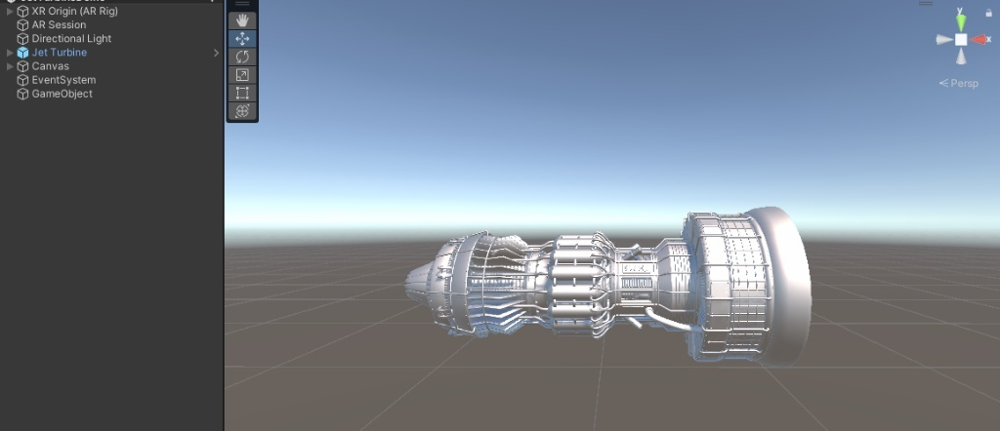
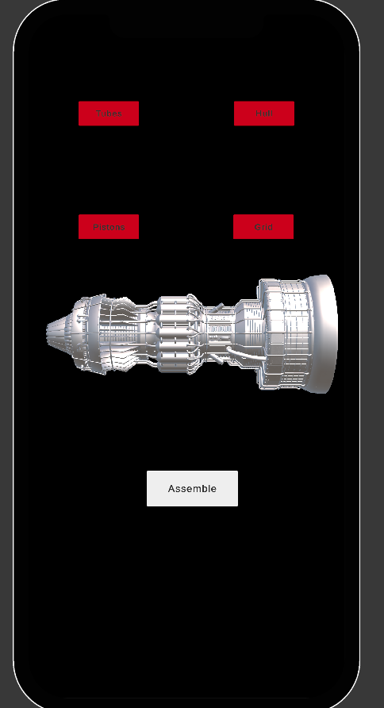

## ✈️ Jet Turbine AR: Interactive Assembly
A mobile Augmented Reality (AR) application developed in Unity that allows users to visualize and interact with a high-fidelity jet engine model in a real-world environment.

## 🚀 Core Features
AR Visualization: Anchors a 3D turbine model to physical surfaces using AR Foundation.

Interactive Inspection: Select and identify key components: ``Tubes``, ``Hull``, ``Pistons``, and ``Grid``.

Assembly Simulation: A dedicated ``Assemble`` function to demonstrate spatial part-to-whole relationships.

Mobile Optimized UI: Clean, high-contrast touch interface for field-use simulation.

## 📸 System Preview
**1. Development Environment**
Built using the XR Origin and AR Session framework to handle world-tracking and camera positioning.

**2. Mobile Interface**
The user interface allows for specific part isolation and a full-system assembly toggle.

## 🛠️ Tech Stack
**Engine:** Unity 2022.3 (LTS)

**AR Framework:** AR Foundation (ARCore / ARKit)

**Language:** C#

**Input:** Mobile Touch Raycasting
