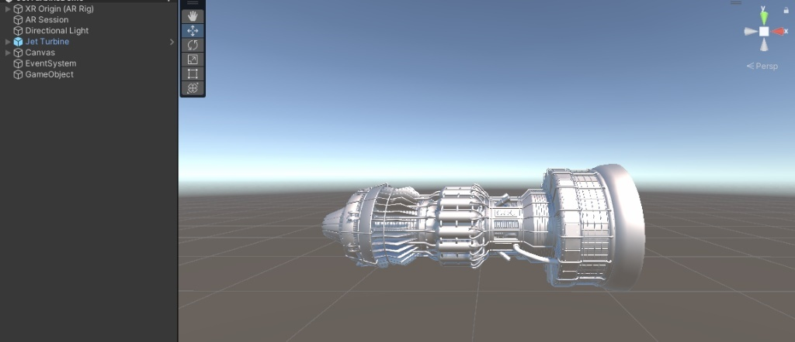
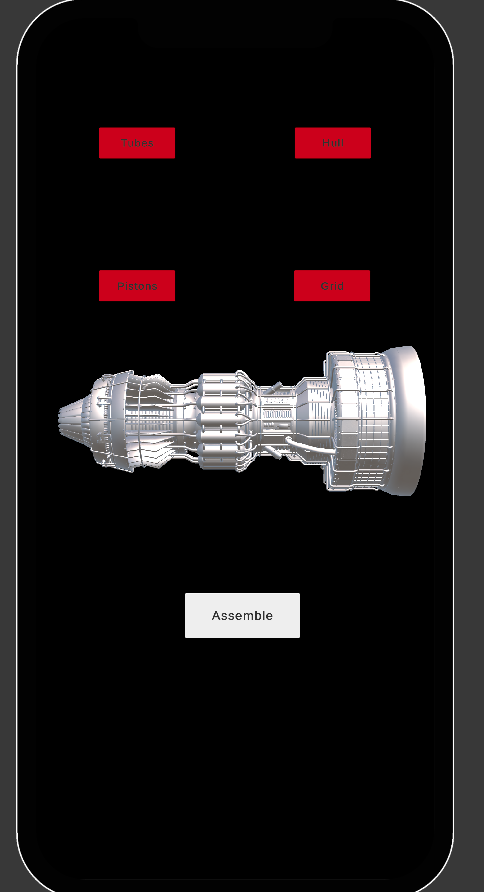

# Jet Turbine AR

A mobile augmented reality app, built in Unity, that places a jet engine model in the room in front of you and lets you hide parts of it to see what sits underneath.

It was built to learn AR Foundation: how a phone tracks the world, how a model gets anchored to it, and how a touch interface works when the model is the screen.

## What it does

The app starts an AR session, anchors the turbine in front of the camera, and shows five buttons. Four of them show or hide one group of parts of the model each: Tubes, Hull, Pistons and Grid. Hiding the hull exposes the internals, so the model can be read from the outside in. The fifth button, Hide All, shows or hides the whole assembly at once.

The model itself is a 65-object prefab, and the four groups are nodes inside it.

## Running it

You need Unity 2022.3.61f1 or a nearby 2022.3 LTS version.

1. Clone the repository and open the folder in Unity Hub.
2. Open `Assets/JetTurbineDemo.unity`.
3. To try it without a phone, open the Simulator view (Window, then General, then Device Simulator) and press Play.
4. To run it on a device, go to File, then Build Settings, switch the platform to Android or iOS, and build. The device needs ARCore (Android) or ARKit (iOS).

## How it is put together

| Piece | What it does |
|---|---|
| AR Session and XR Origin | Handle world tracking and camera positioning through AR Foundation |
| `Jet Turbine` prefab | The model, with its parts grouped so they can be hidden separately |
| `Assets/Scripts/Toggle.cs` | The one script: shows or hides the object it is attached to |
| Canvas | The buttons, wired to `Toggle.toggle` |

## What it does not do

- **There is no touch interaction with the model.** You cannot tap a part to select it, or rotate or scale the turbine. The buttons are the only input.
- **Parts are hidden, not labeled.** Nothing on screen names the part you just toggled.
- **Placement is fixed.** The turbine is anchored in front of the camera at startup rather than on a detected plane you choose.
- **The XR Interaction Toolkit and the new Input System are installed but unused.** They came in with the AR template and no code references them.

## Built with

Unity 2022.3 LTS, AR Foundation 5.2 with ARCore and ARKit, the Universal Render Pipeline, and C#.

## Credits

The turbine model is third-party, obtained as a free asset. Its original source was not recorded, so it is not credited here by name; it is not my work. Everything else in this repository is mine.

## License

MIT for the code. See [LICENSE](LICENSE). The license does not cover the third-party model in `Assets/Assets/Jet Engine/`.
